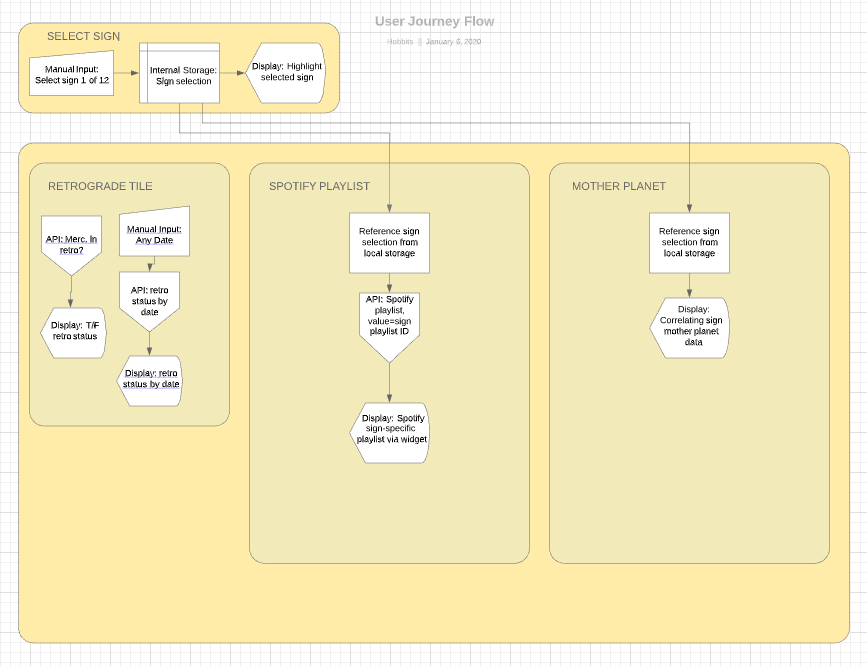
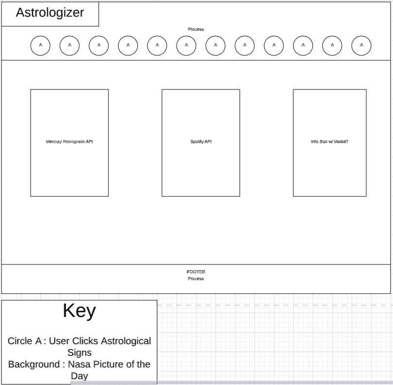

# Astrologizer

* https://github.com/magsmagsmags/CosmicAstrologizer.git
* https://magsmagsmags.github.io/CosmicAstrologizer/

# Project Description
 Build web application from scratch that allows the user to select from a list of astrological zodiac signs and then display information to the user that is specific to that sign.  To acheive this, we will utilize API calls to get Mercury retrograde information, display Spotify playlists, and disdplay a photo of the day from NASA.  
   

# User Story
AS A a cosmic informational seeker I WANT to find information about Mercury retrograde SO THAT I can accurately understand the intricacies of my horoscope to better get in touch with the universe.

# Wireframe
  

# How to Use The Site
1. Click the Get Astrologized button to scroll down to the section of zodiac sign buttons.
1. Click a zodiac sign button to update the astrological information on the page to the one selected

# APIs Used
* NASA Picture of the Day || "https://api.nasa.gov/planetary/apod?api_key=rYHbWVB1P6xDiWadsZ91DWA5QzfvGnUL881Rgcdn"
* Spotify render a playlist by ID widget || https://api.spotify.com/v1/playlists/37i9dQZF1DX6PdsVYbP4rI
* Mercury Retrograde Status || https://www.programmableweb.com/api/mercury-retrograde
* Zodiacly - The Zodiac API || https://zodiacal.herokuapp.com/

# Task Breakdown
1. Link Bulma styling (complete)
1. Create homepage/main page (complete)
    1. Create nav bar (in progress)
    1. Create selectors for 12 astrological signs in nav bar
    1. Link selected sign to local storage
    1. highlight/add border to selected sign onclick
1. Create div holder for NASA background API - photo of the day (complete)
    1. Call NASA API
    1. GET 
    1. Render 
1. Create 3 tiles for main content (complete)
1. Tile 1: Mercury Retrograde information
    1. Link moment js
    1. Call API to render current retrograde status
    1. Add date input & submit button
    1. Call API to render retrograde status of inputted date
1. Tile 2: Spotify playlist recommendation
    1. create div for playlist to be rendered in. 
    1. reference sign selected in local storage
    1. call Spotify API with playlist ID specific to sign selected 
    1. GET
    1. Render playlist in widget inside tile
1. Tile 3: Ruling Planet by sign
    1. Create div for js text to render
    1. Reference selected sign from local storage
    1. Display associated "ruling planet" infomation correlated to the selected sign
1. Sticky footer (complete)
1. Media queries
    1. change NASA image from background to small image above tiles
    1. switch tiles to stack
    1. general mobile responsiveness 
    

# Contribute
Please reach out to collaborators Brianna McCray, Luke Duquette, or Maggie Kiefer (sheakiefer@gmail.com) for code suggestions, critiques, feedback, or offers to collaborate. 

# Credits

* Brittany Taylor
* Israel Medina
* Eric Scott

--------------------------------
